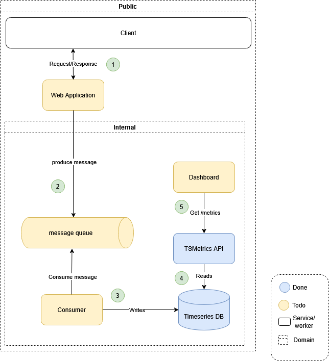

# TSMetrics

#### Overview

This is a sketch project that uses TimescaleDB to show timeseries data in a .NET 9 minimal API.

The idea of this project is that we have some timeseries data with metrics of our main service (e.g.: cpu_usage, response_times, add-to-cart-clicks). 
Then we expose this in an internal REST API that we can use in internal dashboards applications.



1. Public web service, for example an ecommerce website, where we are implementing A/B tests in new released features.
2. The public web service, produces messages with some metrics to an internal message queue
3. We have some consumer service responsible to read this messages and store them in our database
4. A REST API that has endpoints to show this metrics and reads them from the database
5. An internal dashboard to see this information, like for example a streamlit application in python

#### Local Testing

**Prerequisites:** Docker

```
docker compose up -d
```

This command starts two containers (TimescaleDb and .Net REST API). 
Some data is automatic seeded in database (can take some seconds) so the API should be ready to use.

For swagger UI use this url:
```
http://localhost:5221/swagger
```

To test the api use for example this:

```
http://localhost:5221/metrics?abTestName=feature_a&metricName=response_time&start=2025-10-13T12:00:00Z&end=2025-11-11T12:00:00Z&granularity=5m
```

An example response from the API:

```json
{
  "abTest": "feature_a",
  "metric": "response_time",
  "unit": "ms",
  "skip": 0,
  "limit": 2,
  "count": 2,
  "isComplete": true,
  "datapoints": [
    {
      "t": 1762689900,
      "a": 98.598,
      "l": 33.062,
      "h": 149.858
    },
    {
      "t": 1762690200,
      "a": 88.466,
      "l": 30.614,
      "h": 144.186
    }
  ]
}
```

#### Possible Next Steps

- Implement Authorization and Authentication
- Manage secrets
- Create a dashboard with streamlit in python to show this data in a web interface for visualization and analysis
- Add a cache layer repository
- Improve test coverage (very low right now)
- Implement ABTest endpoint and metrics
- Create new tables to manage abtest and metrics

#### Local Development

**Prerequisites:** Docker, Docker Compose, .Net 9 SDK

```
docker compose up timescaledb -d
docker 
dotnet build
dotnet run --project src/TSMetricsAPI/TSMetricsAPI.csproj
```